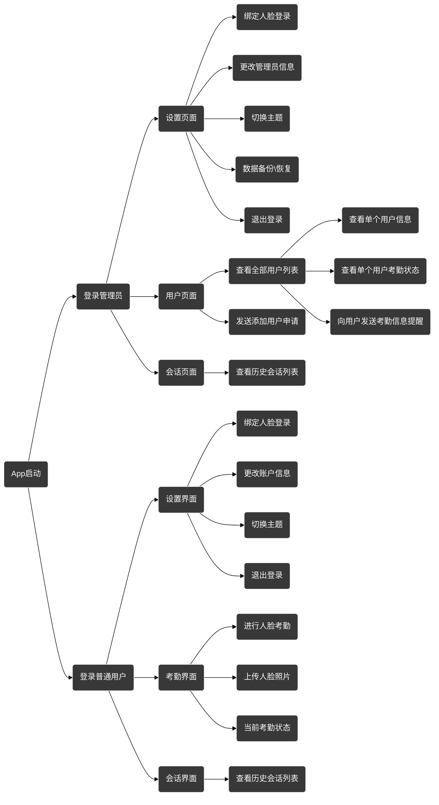
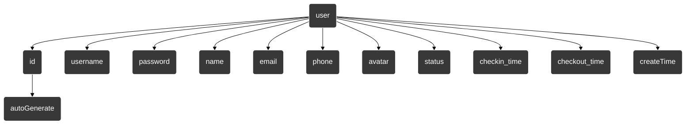

# 

## 运行环境

考虑依赖库文件较大不能放在github需要手动下载:

下载依赖库文件: https://drive.google.com/file/d/1gazdboqeN86m4XUn-yR2MQEooD-cPzF0/view?usp=share_link

解压缩到jniLibs目录下

打开项目执行build->Refresh Linked C++ Project 编译

即可运行App

## App设计

## 考勤设计

### 用户端
1. 通过人脸采集功能上传可作为人脸识别的模型来申请作为人脸考勤唯一凭证

2. 通过人脸识别选项来进行判断是否由本人操作，最终纪录考勤时间以及更新考勤状态

考勤状态分为3种情况：
- 未考勤（每个用户默认状态）
- 开始考勤（完成当天考勤签到）
- 完成考勤（完成当前考勤签退）

	
其中当天首次签到后半小时内重复签到则算作重复签到，App会记录最新一次考勤时间。半小时后考勤则算签退考勤，同样签退考勤后的半小时也算作重复签退，并记录最后一次考勤时间。在当天的`20:00`前完成签退考勤则算完成考勤任务

> 每次考勤数据应该存储，不然用户可以随便让一个人考勤

### 管理员端

1. 通过审批模式来通过用户将作为人脸考勤模型的人脸照片

2. 通过用户列表来管理所有待考勤用户，可以实时的查看每个用户的考勤状态、签到时间、签退时间。在用户忘记考勤时可以开启会话列表来提醒用户考勤

## 数据库设计
>每天6点重置考勤数据

- `id`: 用户唯一标识，可以是自增长的整数类型或UUID字符串类型。
- `username`: 用户名，可以是字符串类型，用于登录和显示用户信息。
- `password`: 用户密码，可以是字符串类型，应该使用哈希加密存储。
- `name`: 用户真实姓名，可以是字符串类型，用于显示用户信息和报表。
- `email`: 用户电子邮件地址，可以是字符串类型，用于发送考勤提醒和报表。
- `phone`: 用户电话号码，可以是字符串类型，用于发送短信或电话提醒。
- `avatar`: 用户头像，可以是BLOB类型或图片文件路径，用于显示用户信息。
- `status`: 用户考勤状态，可以是整数类型或枚举类型，用于记录用户当前的考勤状态（如未考勤、正在考勤、完成考勤等）。
- `checkin_time`: 用户签到时间，可以是日期时间类型，用于记录用户签到时间。
- `checkout_time`: 用户签退时间，可以是日期时间类型，用于记录用户签退时间。
- `create_time`: 账号创建时间

## 默认用户
id |name| password
-|-|-
0 	|root	    |123
1 	|yangjing	|123
2 	|Atomu	  |111
3 	|LiangZhaoyang	|111
4 	|WuYiming	|111
5 	|ZhangXiangyu	|111
6 	|ChenWeijie	|111
7 	|LiuJiahui	|111
8 	|SunQianying	|111
9 	|WangJianfeng	|111
10	|ZhouXingyu	|111
11	|HuangYifan	|111
12	|LiMinghui	|111
13	|DengYuhan	|111
14	|TangZhengyang	|111
15	|LinQingyang	|111
16	|GaoXiaodong	|111
17	|HuQianwen	|111
18	|JinXinyi	|111
19	|FengYunlong	|111
20	|CaoXinran	|111
21	|LiJiaming	|111
22	|ZhouYifei	|111
23	|WuYufei	|111
24	|ChenJianyu	|111
25	|XuYuhang	|111
26	|ZhangXinyi	|111
27	|WangMengjie	|111
28	|LiuXiaowei	|111
29	|HuangZhihao	|111
30	|YangKaiwen	|111
31	|ShenZhihui	|111
32	|GuoYaqi	|111
33	|TangXueqin	|111
34	|DengYuting	|111
35	|JiangYingjie	|111
36	|HuShanshan	|111
37	|YaoZhijun	|111
38	|FanXiaojing	|111
39	|MeiXiaochen	|111
40	|CaiMengxuan	|111
